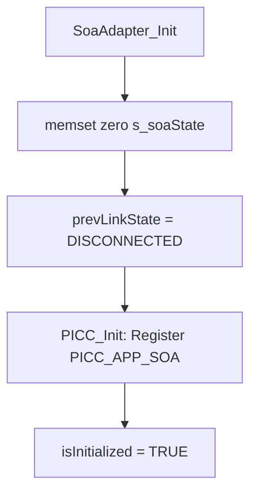
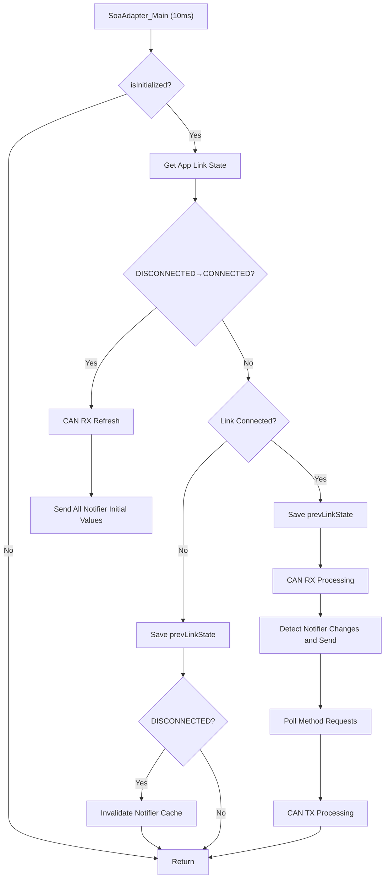
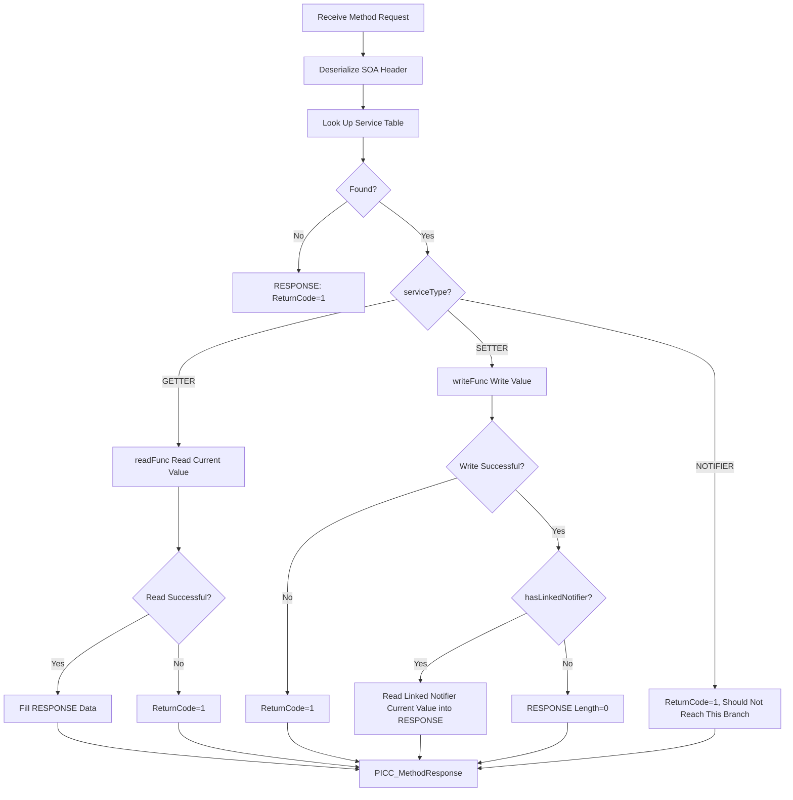

# SOA Adapter Module Design Document

| Number | Date | Author | Approver | Revision History | Status |
|--------|------|--------|----------|------------------|--------|
| V0.1 | 2026.5.18 | weizhichun | | create initial version | draft |
| V0.1 | 2026.5.21 | weizhichun | Li Yijie | Reviewed by lisong and Liyijie | Approved |

| Item | Description |
|------|-------------|
| Module Name | SOA Adapter |
| Target Platform | S32G399A M7 Core (FreeRTOS) |

---

## 1. Overview

SOA Adapter is the SOA (Service-Oriented Architecture) adaptation layer module on the M-Core, responsible for bridging CAN signal data from within the M-Core to the SOA service framework on the A-Core. This module communicates with the A-Core through the PICC middleware via the IPCF shared memory channel.

**Data Flow:**
```
CAN Bus <-> DBC Structs <-> SOA Adapter <-> PICC API <-> IPCF <-> A-Core
```

---

## 2. Architecture Design

### 2.1 Module Composition

| File | Responsibility |
|------|---------------|
| `soa_adapter_main.h` | Public interface declarations |
| `soa_adapter_main.c` | Core logic implementation (serialization, Notifier transmission, Method processing, main loop) |
| `soa_adapter_cnf.h` | Configuration definitions (SOA Header structure, service matrix, ID macros) |
| `soa_adapter_cnf.c` | Configuration instantiation (signal read/write functions, service configuration table) |

### 2.2 External Dependencies

| Dependency Module | Purpose |
|-------------------|---------|
| `picc_api.h` | PICC driver public API (Init, SendEvent, MethodResponse, GetMethodData, etc.) |
| `HpcCan_Driver.h` | AUTOSAR CAN transmit/receive interface |
| `SOA_CANdbc_Generated.h` | DBC-generated CAN signal global structs |
| `Platform.h` | Platform base type definitions (uint8, uint16, sint8, boolean, etc.) |

### 2.3 PICC Registration Configuration

```c
localId    = 71 (0x47)    // M-Core SOA Provider ID (ID range 71-80)
remoteId   = 76 (0x4C)    // A-Core SOA Consumer ID
role       = PICC_ROLE_SERVER
channelId  = 2            // IPCF Channel 2
appIndex   = PICC_APP_SOA (7)
mode       = Polling      // methodHandler = NULL, eventHandler = NULL
```

---

## 3. Protocol Format

### 3.1 Two-Layer Protocol Structure

```
┌──────────────────┬──────────────────────────────────────┐
│  IPC 8B Header   │            IPC Payload               │
│ (PICC layer)     │         (SOA Adapter layer)          │
│                  ├──────────────────┬───────────────────┤
│                  │  SOA 12B Header  │  SOA Actual Data  │
└──────────────────┴──────────────────┴───────────────────┘
```

### 3.2 SOA Header (12 Bytes, Big-Endian)

| Byte Offset | Field | Length | Description |
|-------------|-------|--------|-------------|
| 0-1 | SOA_ServiceID | 2B | AP Service ID |
| 2-3 | SOA_MethodID | 2B | AP Method/Event ID |
| 4-5 | SOA_InstanceID | 2B | AP Instance ID |
| 6-7 | SOA_SessionID | 2B | Session ID (fixed at 0 for Notifier; echoed from request for Getter/Setter) |
| 8-9 | SOA_ReturnCode | 2B | Return code (0 = success, non-zero = failure) |
| 10-11 | SOA_Length | 2B | Length of the subsequent actual parameter data |

**Corresponding Code Struct:**
```c
typedef struct {
    uint16 SOA_ServiceID;
    uint16 SOA_MethodID;
    uint16 SOA_InstanceID;
    uint16 SOA_SessionID;
    uint16 SOA_ReturnCode;
    uint16 SOA_Length;
} SOA_Header_t;
```

### 3.3 IPC Layer Fixed ID Mapping

| SOA Business Type | IPC Layer ID | IPC MessageType |
|-------------------|-------------|-----------------|
| All Notifiers/Events (M→A) | EventID = 3 | 0x09 (NOTIFICATION_WITHOUT_ACK) |
| All Getters/Setters/Methods (A→M→A) | MethodID = 1 | 0x05 (REQUEST) → 0x80 (RESPONSE) |

---

## 4. Service Matrix

### 4.1 Service Configuration Table

| Index | Service Interface Name | ServiceID | MethodID | InstanceID | Type | Data Source | Size |
|-------|----------------------|-----------|----------|------------|------|-------------|------|
| 0 | Atom_VCU_DriSpeedSt | 0x0001 | 0x8001 | 0x0001 | Notifier | `g_rx_Standard_200_Rx.VehicleSpeed` | 2B |
| 1 | Atom_VCU_ParkingSt | 0x0002 | 0x5001 | 0x0001 | Getter | `g_rx_Standard_200_Rx.ParkingSts` | 1B |
| 2 | Atom_VCU_HighVoltageBatterySt | 0x0003 | 0x5001 | 0x0001 | Getter | `g_rx_Standard_200_Rx.HighVoltageBatterySts` | 2B |
| 3 | Atom_VCU_IgnitionSt | 0x0004 | 0x5001 | 0x0001 | Getter | `g_tx_Standard_100_Tx.IgnitionSts` | 1B |
| 4 | Atom_BCM_VehicleMode | 0x0005 | 0x5001 | 0x0001 | Setter | `g_tx_Standard_100_Tx.VehicleMode` | 1B |
| 5 | Atom_BCM_VehicleModeSt | 0x0005 | 0x8001 | 0x0001 | Notifier | `g_tx_Standard_100_Tx.VehicleMode` | 1B |

### 4.2 Setter-Notifier Linkage

Entry[4] (Setter) and Entry[5] (Notifier) share the same ServiceID=0x0005:
- `hasLinkedNotifier = TRUE`
- `linkedNotifierIdx = 5`
- After a successful Setter write, the linked Notifier&#39;s current value is read via Entry[5]&#39;s `readFunc` and placed into the RESPONSE

### 4.3 Notifier Index Table

```c
g_soaNotifierIndices[SOA_NOTIFIER_COUNT=2] = { 0, 5 };
// [0] → DriSpeedSt Notifier (ServiceTable[0])
// [1] → VehicleModeSt Notifier (ServiceTable[5])
```

---

## 5. Core Data Structures

### 5.1 Service Configuration Entry

```c
typedef struct {
    uint16              SOA_ServiceID;
    uint16              SOA_MethodID;
    uint16              SOA_InstanceID;
    SOA_ServiceType_e   serviceType;       // NOTIFIER / GETTER / SETTER
    SOA_SignalReadFunc_t  readFunc;         // Signal value read function pointer
    SOA_SignalWriteFunc_t writeFunc;        // Signal value write function pointer
    uint16              SOA_EventGroupID;
    uint8               dataSize;
    boolean             hasLinkedNotifier;
    uint8               linkedNotifierIdx;
} SOA_ServiceConfig_t;
```

### 5.2 Notifier Change Detection Cache

```c
typedef struct {
    uint8   prevData[SOA_MAX_DATA_SIZE];  // Previous signal value
    uint16  prevLen;                       // Previous data length
    boolean isValid;                       // TRUE after first read
} SOA_NotifierCache_t;
```

### 5.3 Module State

```c
typedef struct {
    boolean             isInitialized;
    PICC_LinkState_e    prevLinkState;                      // Link state edge detection
    SOA_NotifierCache_t notifCache[SOA_NOTIFIER_COUNT];     // Change detection cache
} SOA_AdapterState_t;
```

### 5.4 Key Constants

| Macro | Value | Description |
|-------|-------|-------------|
| `SOA_HEADER_SIZE` | 12 | SOA protocol header size (bytes) |
| `SOA_MAX_DATA_SIZE` | 256 | Maximum payload per single message |
| `SOA_MAX_MSG_SIZE` | 268 | Header + Data |
| `SOA_SERVICE_TABLE_COUNT` | 6 | Total number of services |
| `SOA_NOTIFIER_COUNT` | 2 | Number of Notifier services |

---

## 6. Functional Flow

### 6.1 Initialization Flow (`SoaAdapter_Init`)



**Integration Point:** Called within `App_Init_All()` in `EcuM_main_init.c`.

### 6.2 10 ms Main Loop (`SoaAdapter_Main`)



### 6.3 Notifier Transmission Flow

#### 6.3.1 Initial Value Synchronization (`SOA_SendAllNotifierInitValues`) — Batched Transmission
- **Trigger Condition:** Link transitions from DISCONNECTED to CONNECTED
- **Behavior:** Iterate over `g_soaNotifierIndices`, **concatenate** each Notifier&#39;s SOA message (12B Header + Data) into `s_soaBatchBuf`, then send all initial values with a **single** `PICC_SendEvent()` call
- **Batch Format:** `[SOA_Header(12B) + Data_1] [SOA_Header(12B) + Data_2] ... [SOA_Header(12B) + Data_N]`
- **Simultaneously:** Initialize the change detection cache (`prevData`, `prevLen`, `isValid=TRUE`)
- **Efficiency:** Reduces N PICC_SendEvent calls to 1, lowering IPC call overhead

#### 6.3.2 Change Detection Transmission (`SOA_CheckAndSendNotifiers`)
- **Period:** 10 ms
- **Behavior:** Read the current value of each Notifier, compare against cache (`memcmp`); if changed, send and update cache

#### 6.3.3 Single Notifier Construction (`SOA_SendNotifier`)
1. Read signal value via `readFunc` into `s_soaTxBuf[12..]`
2. Build SOA Header (SessionID=0, ReturnCode=0)
3. Serialize Header into `s_soaTxBuf[0..11]`
4. Call `PICC_SendEvent(PICC_APP_SOA, EventID=3, buf, len, WITHOUT_ACK)`

#### 6.3.4 SOA-Level Batching

Per the SOA protocol specification: *Multiple Event/Notifier 14-byte data bodies can be concatenated into a single long Payload within the same underlying message for increased transmission efficiency*.

**Current Implementation Scope:** SOA-level batching is used only during the initial value synchronization phase (`SOA_SendAllNotifierInitValues`). Periodic change-detection transmission (`SOA_CheckAndSendNotifiers`) still sends one message at a time.

**Batch Data Format:**
```
┌────────────────────────────────┬────────────────────────────────┬─────┐
│ SOA Msg 1 (12B Hdr + Data)    │ SOA Msg 2 (12B Hdr + Data)    │ ... │
└────────────────────────────────┴────────────────────────────────┴─────┘
                    ↓ Treat entire block as a single IPC Payload ↓
┌──────────────────┬──────────────────────────────────────────────┐
│  IPC 8B Header   │         Batched SOA Payload                 │
└──────────────────┴──────────────────────────────────────────────┘
```

**Example (current 2-Notifier initial value sync):**
```
SOA Msg 1: VehicleSpeed (14B = 12B header + 2B data)
  00 01  80 01  00 01  00 00  00 00  00 02  XX XX

SOA Msg 2: VehicleModeSt (13B = 12B header + 1B data)
  00 05  80 01  00 01  00 00  00 00  00 01  XX

→ Concatenated PICC_SendEvent payload length = 14 + 13 = 27 bytes
```

**Key Constraints:**
- Total batch size must not exceed `SOA_MAX_MSG_SIZE` (268B)
- A-Core must unpack message by message according to `SOA_Header.SOA_Length` during parsing
- This batching is only concatenation of SOA-layer data; the underlying IPCF stacking (CRC enable bit + Counter + CRC16) is handled independently by the PICC Stack layer

### 6.4 Method Request Processing Flow

#### 6.4.1 Polling (`SOA_PollMethodRequests`)
- Call `PICC_GetMethodData(PICC_APP_SOA, MethodID=1, ...)` to check for pending requests
- Upon receiving data, call `SOA_HandleMethodRequest()`

#### 6.4.2 Request Handling (`SOA_HandleMethodRequest`)



**Key Rules:**
- RESPONSE must echo the `SOA_SessionID` from the request
- Setter+Notifier linkage: after a successful write, read the linked Notifier&#39;s current value as the RESPONSE data
- Setter without linkage: return an empty RESPONSE with `Length=0`

---

## 7. Link State Management

### 7.1 State Machine

```
DISCONNECTED ──(A-Core Server replies with connection confirmation)──> CONNECTED
CONNECTED ──(A-Core sends disconnect notification / heartbeat timeout)──> DISCONNECTED
```

### 7.2 SOA Adapter Link-Aware Behavior

| State Transition | SOA Adapter Behavior |
|-----------------|---------------------|
| DISCONNECTED → CONNECTED | Refresh CAN RX → Send all Notifier initial values → Initialize change detection cache |
| CONNECTED (steady state) | Normal Notifier change detection + Method polling |
| → DISCONNECTED | Stop business transmission, invalidate all Notifier caches (`isValid=FALSE`) |
| Re-CONNECTED | Send all Notifier initial values again (guarantees A-Core state synchronization) |

### 7.3 M-Core Constraints

- Before link establishment: **Prohibit** sending any SOA business data
- On disconnection: Immediately stop SOA business message transmission
- Only send `WITHOUT_ACK` Events (M-Core real-time constraint)

---

## 8. Signal Read/Write Functions

### 8.1 Read Functions (Notifier + Getter)

| Function | Signal Source | Serialization | Return Length |
|----------|--------------|---------------|---------------|
| `SOA_ReadVehicleSpeed` | `g_rx_Standard_200_Rx.VehicleSpeed` | uint16 big-endian | 2B |
| `SOA_ReadWorkVehicleMode` | `g_tx_Standard_100_Tx.VehicleMode` | uint8 | 1B |
| `SOA_ReadParkingSts` | `g_rx_Standard_200_Rx.ParkingSts` | uint8 | 1B |
| `SOA_ReadHighVoltageBatterySts` | `g_rx_Standard_200_Rx.HighVoltageBatterySts` | uint16 big-endian | 2B |
| `SOA_ReadIgnitionSts` | `g_tx_Standard_100_Tx.IgnitionSts` | uint8 | 1B |

### 8.2 Write Functions (Setter)

| Function | Signal Target | Input | Return |
|----------|--------------|-------|--------|
| `SOA_WriteVehicleMode` | `g_tx_Standard_100_Tx.VehicleMode` | 1B uint8 | 0=success, 1=failure |

### 8.3 Function Signatures

```c
typedef uint16 (*SOA_SignalReadFunc_t)(uint8 *outBuf, uint16 maxLen);
typedef uint8  (*SOA_SignalWriteFunc_t)(const uint8 *inBuf, uint16 len);
```

---

## 9. Static Memory Allocation

| Variable | Type | Size | Purpose |
|----------|------|------|---------|
| `s_soaState` | `SOA_AdapterState_t` | ~518B | Module state + Notifier cache |
| `s_soaTxBuf` | `uint8[]` | 268B | Buffer for building individual Notifier transmissions |
| `s_soaBatchBuf` | `uint8[]` | 268B | Batch buffer for initial value synchronization |
| `s_methodRxBuf` | `uint8[]` | 268B | Method request receive buffer |
| `s_methodRspBuf` | `uint8[]` | 268B | Method response build buffer |

> Total static RAM usage approximately **1.6 KB**

---

## 10. CAN Signal Mapping

### 10.1 CAN RX (Receive)

| CAN ID | DBC Struct | Signals Used by SOA |
|--------|-----------|---------------------|
| 0x200 | `g_rx_Standard_200_Rx` | VehicleSpeed, ParkingSts, HighVoltageBatterySts |

### 10.2 CAN TX (Transmit)

| CAN ID | DBC Struct | Signals Used by SOA |
|--------|-----------|---------------------|
| 0x100 | `g_tx_Standard_100_Tx` | VehicleMode, IgnitionSts |

---

## 11. Message Examples

### 11.1 Notifier: VehicleSpeed = 120 km/h (0x0078)

**SOA Payload (12+2=14 bytes):**
```
00 01  80 01  00 01  00 00  00 00  00 02  00 78
│ServiceID│MethodID│InstanceID│SessionID│ReturnCode│ Length │ Data │
```

**IPC Layer Call:**
```c
PICC_SendEvent(PICC_APP_SOA, 3, payload, 14, PICC_EVENT_WITHOUT_ACK);
```

### 11.2 Getter: A-Core Requests ParkingSts

**A→M Request SOA Payload:**
```
00 02  50 01  00 01  00 03  00 00  00 00
│ServiceID│MethodID│InstanceID│SessionID│ReturnCode│Length=0│
```

**M→A Response SOA Payload (ParkingSts=2):**
```
00 02  50 01  00 01  00 03  00 00  00 01  02
│ServiceID│MethodID│InstanceID│SessionID│ReturnCode│Length=1│Data│
```

### 11.3 Setter: A-Core Sets VehicleMode=1 (with Linked Notifier)

**A→M Request:**
```
00 05  50 01  00 01  00 05  00 00  00 01  01
```

**M→A Response (reads linked Notifier current value=1):**
```
00 05  50 01  00 01  00 05  00 00  00 01  01
```

---

## 12. Integration Notes

### 12.1 Initialization Sequence

```
1. PICC_PreOS_Init()          // IPCF driver + PICC infrastructure
2. HpcCan_Init()              // CAN driver initialization
3. SoaAdapter_Init()          // SOA Adapter registration (in App_Init_All())
4. vTaskStartScheduler()      // Start RTOS
```

### 12.2 Periodic Task

```
TASK_M0_10MS() {
    ...
    SoaAdapter_Main();    // Called every 10 ms
    ...
}
```

---

## 13. Extension Guide

### 13.1 Steps for Adding a New Signal

1. **`soa_adapter_cnf.h`**: Add ServiceID/MethodID macros and index macros; update `SOA_SERVICE_TABLE_COUNT`
2. **`soa_adapter_cnf.c`**: Implement Read/Write functions; add entry to `g_soaServiceTable`
3. If it is a Notifier: update `SOA_NOTIFIER_COUNT` and `g_soaNotifierIndices`
4. If it is a Setter+Notifier linkage: set `hasLinkedNotifier=TRUE` and `linkedNotifierIdx`

### 13.2 Design Constraints

- M-Core only sends `WITHOUT_ACK` Events
- M-Core does not support synchronous waiting; all operations are asynchronous/polling
- Prohibit sending business data before link establishment
- All multi-byte fields use big-endian serialization
- **Initial value synchronization uses SOA-level batching** (multiple Notifiers concatenated into a single IPC Payload); periodic change detection sends one message at a time
